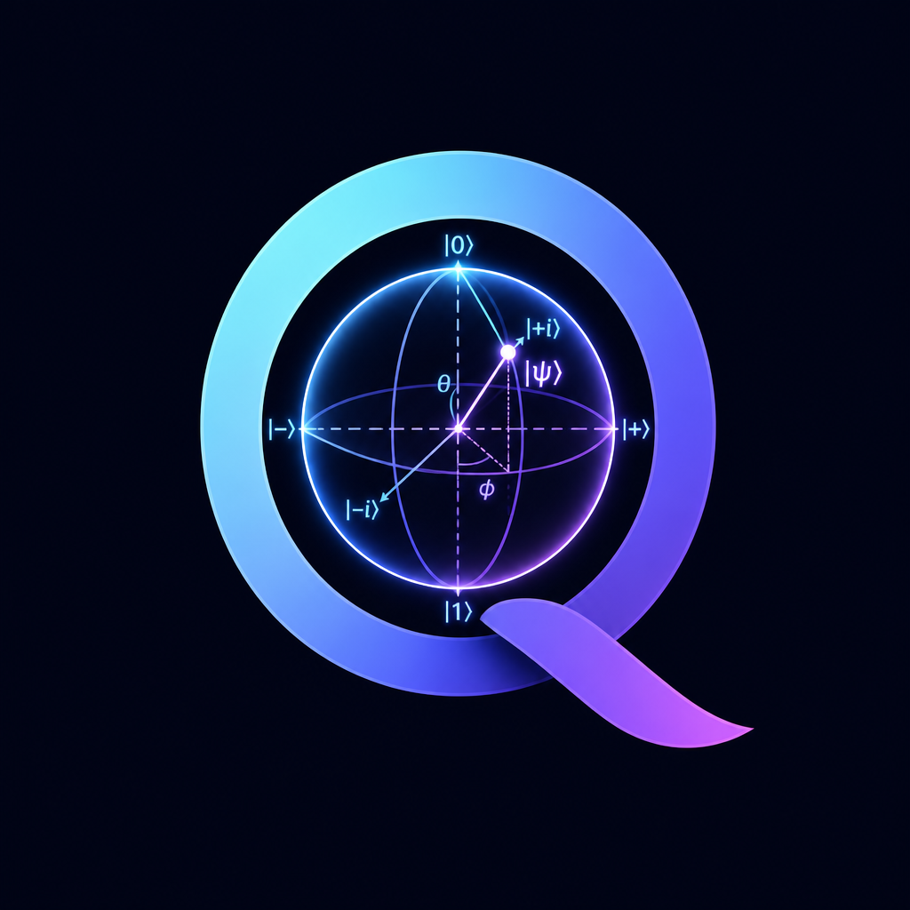
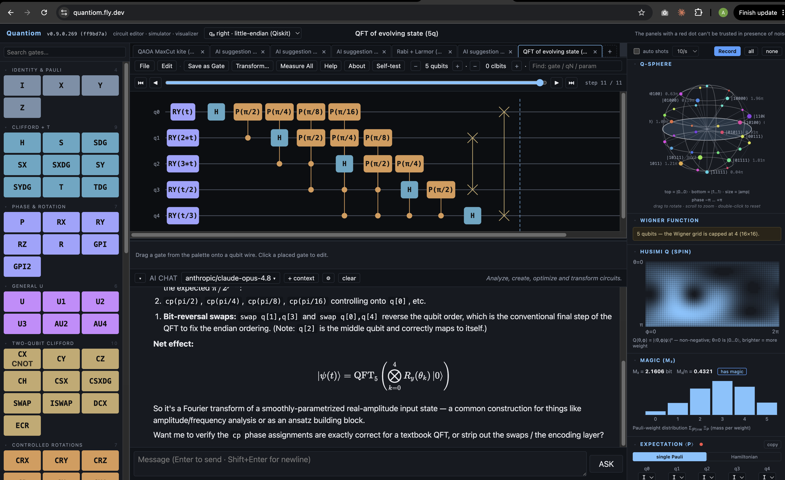

<p align="center">
  
</p>

<h1 align="center">Quantiom</h1>

[](https://github.com/thepacket/quantiom/actions/workflows/ci.yml)
[](https://doi.org/10.5281/zenodo.20540701)
[](LICENSE)

**A browser-native research-grade quantum circuit editor, simulator,
workstation, and visualizer.**



Quantiom is a quantum circuit workstation that runs entirely in your
browser — no install, no account. It's built for people already
comfortable with quantum computing: the editor is never simplified to
accommodate beginners, and the analysis panels are treated as peers of
the editor, not afterthoughts.

**Editor.** A multi-tab editor over a 64-gate palette, with
arbitrary-angle rotations, arbitrary unitary matrices, custom gates and
subroutines, classical registers, mid-circuit measurement, conditional
gates, and anti-controls.

**Three simulators.** A pure-TypeScript `Float64Array` statevector
simulator (≤ 20 qubits); an Aaronson–Gottesman stabilizer tableau
(≤ 1024 qubits, with Pauli-frame tracking for depolarising noise); and a
quantum-trajectory noise simulator with calibrated NISQ channels.

**Expectation & optimisation.** The Expectation panel evaluates a single
Pauli string or a full weighted Pauli-sum Hamiltonian, with Adam, SGD,
and Quantum Natural Gradient (Fubini–Study metric) optimisers, zero-noise
extrapolation, probabilistic error cancellation, and conditional ⟨P⟩
post-selected on a classical-bit outcome.

**Noise modelling.** Per-gate-id, per-qubit, T1 / T2, crosstalk,
readout, and 1- and 2-qubit custom Kraus channels — all importable from
IBM `BackendProperties` JSON. WebGPU runs noisy trajectories in parallel
where the circuit fits the support set, feeding the Probabilities panel
and the Optimise / Landscape / Plateau / ZNE loops (with a CPU fallback).

**Compile & hardware.** A one-click Compile pipeline runs Transpile →
Optimise → Route → Optimise to a target native gate set with per-stage
gate counts; arbitrary two-qubit unitaries are KAK-decomposed (Cartan,
faithful Cirq port) for the IBM and Rigetti targets. The Hamiltonian
panel builds Trotter circuits (order 1, 2 Strang, 4 Suzuki, or QDrift).
Process tomography reconstructs the χ matrix in a heatmap or Hinton view;
equivalence-checking compares two open tabs by process fidelity and trace
distance.

**Characterization & benchmarking.** Randomized benchmarking fits the
single-qubit Clifford fidelity decay to a SPAM-robust error-per-Clifford —
with interleaved (gate-specific error) and unitarity (error-coherence) modes.
Quantum Volume runs Haar-SU(4) model circuits and tests the heavy-output
probability against the 2/3 threshold; mirror / volumetric benchmarking maps
the success frontier over a width × depth grid; cross-entropy benchmarking
(XEB) tracks the linear fidelity of random circuits per cycle; simultaneous RB
measures crosstalk / addressability; T1 / T2 experiments fit the coherence-time
decays; a Pauli error budget breaks the noise model into per-qubit X/Y/Z
contributions. A QEC workbench runs a repetition-code syndrome-lookup decoder
and plots the logical-error curves crossing the threshold; syndrome sampling
exercises stabilizer codes under a Pauli-frame noise tracker.

**Visualisers.** A column of 30-plus entanglement, dynamics, and
diagnostic visualisers sits alongside the statevector / probability /
Bloch panels: mutual information, entanglement spectrum and entropy
profile, ZZ correlations, space–time ⟨Z⟩ and entropy, t-sweep traces and
their Fourier spectrum, amplitude·phase, unitary heatmap, interaction
graph, discrete-Wigner and spin Husimi-Q phase space, magic
(stabilizer-Rényi M₂), entanglement negativity and pairwise Wootters
concurrence, Loschmidt / DQPT, the Pauli transfer matrix, Bloch
trajectories, OTOC scrambling, exact Hamiltonian spectra with the
spectral form factor, level-spacing statistics and the diagonal-ensemble
(ETH) populations, the quantum Fisher information and Fubini–Study
geometric tensor, participation / IPR, symmetry-sector and coherence
readouts, a fidelity / purity and decoherence-movie view in noise mode, a
dynamic-measurement branch tree, a Tanner / check graph, a Q-sphere, a
ZX-calculus diagram, and a causal-cone overlay.

**AI assistant.** An optional chat panel talks to OpenRouter (any model,
your own key), receives the current circuit as OpenQASM 3 on every turn,
and auto-opens any OpenQASM block in its reply as a new tab. A searchable,
categorized **prompt library** drops ready-made prompts into the box. A
**dialogue mode** turns it into a debate: two model instances take roles
(Proposer ↔ Critic, Professor ↔ Student, IBM ↔ Rigetti, or your own) and
discuss the circuit turn by turn — every turn grounded in the same
simulator context, so the exchange stays checkable. Stop or jump in at
any point, and export the whole transcript (with the circuit embedded) as
Markdown.

**Interoperability.** Circuits round-trip OpenQASM 3 (and parse
OpenQASM 2), export to Qiskit, Cirq, Braket, Q#, PyQuil, pytket,
OpenQASM 2, LaTeX (quantikz), JSON, and SVG, serialise into a shareable
URL hash, and the `t`-animation can be recorded as a WebM video.

Live: **<https://quantiom.fly.dev>**

## Documentation

- **[Tutorial walkthrough](docs/tutorial.md)** — a workflow-based tour
  in six parts: foundations (build/edit), reading the state (the
  visualisers by task), noise & mitigation, optimisation & algorithms
  (VQE, Trotter, the Clifford fast path), hardware & interop
  (transpile/export), and the AI assistant. Every section ends with
  "what to look at" and links to the panel reference for detail.
- **[Panel reference](docs/panels.md)** — every user-facing panel:
  what it shows, when it's available, key controls, default-fast
  behaviour, and a "Tip" callout for the non-obvious things.
- **[Architecture](docs/architecture.md)** — codebase map: data flow
  (editor → simulate → panels), the noise / Clifford / WebGPU fast
  paths, the optimise→transpile→route pipeline, storage keys, and the
  performance invariants.
- **[OpenQASM & export](docs/qasm.md)** — the round-trip contract,
  the `// qubit_names:` / `// note:` comment directives, and the
  conventions of all eight SDK / LaTeX emitters.

All four are also rendered inside the app — open the toolbar **Help**
menu. They're imported at build time, no network fetch. The **About**
item (next to Help) shows the version, GitHub link, authorship, and
licence.

## Community

Questions, ideas, and show-and-tell go in
**[GitHub Discussions](https://github.com/thepacket/quantiom/discussions)**;
bug reports and feature requests in
**[Issues](https://github.com/thepacket/quantiom/issues)**.

Quantiom is moving fast and the surface to verify is wide — 64 gates,
three simulator backends, an AI chat assistant, ~65 panels (40 of them
entanglement / dynamics / state visualisers), OpenQASM 3 round-trip,
and nine code/format emitters. Expect rough edges; bug
reports against any of it are welcome.

## Testing

The numeric core is backed by a **comprehensive automated test suite** —
**859 tests (~96% statement coverage)** that run in continuous integration
on **every push** (`.github/workflows/ci.yml`). They verify the statevector
simulator (incl. the `initialize()` gate and X/Y-basis measurement), every
gate's matrix unitarity and algebra, the Clifford tableau (with the
single-qubit Bloch reduction and noisy Pauli-frame), Pauli expectations,
circuit equivalence, gate inversion, the OpenQASM 3 round-trip and parser
branches, all eight SDK / LaTeX emitters, the transpiler / router /
Trotter builder, the noise simulator + IBM importer, the optimiser, PEC,
process tomography, KAK decomposition, the editor reducers, and every
visualiser / analysis substrate — including participation/IPR, concurrence,
QFI, the quantum geometric tensor, symmetry sectors, coherence, the spectral
form factor, level statistics, the diagonal ensemble, and the dynamic branch
tree — each checked against analytic ground truth.

You don't have to take that on faith: the toolbar **Self-test** button
re-runs a **380-check** cross-section of the same engine **live in your
browser** in ~10 ms and shows the pass/fail report — itself a subset of
the full **859-test** suite that runs in CI on every commit. See
[Architecture → Testing](docs/architecture.md#testing) for the full
breakdown.

## Authorship

Quantiom is a two-name project:

- **[Claude](https://www.anthropic.com/claude-code)** — Anthropic's
  coding agent, sole coder. Every line of TypeScript, Python, the
  Dockerfile, the `fly.toml`, and the docs you're reading was written
  by the agent.
- **[Andre Paquette](https://github.com/andrepaquette)** — human
  maintainer. Set the direction, made design and scope decisions,
  evaluated each iteration on a real fly.io deployment, and decided
  when to ship — but didn't write the code by hand.

Bugs and design choices are the agent's; the call to keep them or fix
them is the maintainer's.

## Citation

If you use Quantiom in your work, please cite it. Repository metadata is
in [`CITATION.cff`](CITATION.cff) (GitHub renders a **"Cite this
repository"** button from it). An archival, versioned DOI is minted via
[Zenodo](https://zenodo.org) on each tagged release.

[](https://doi.org/10.5281/zenodo.20540701)

The DOI above is the *concept* DOI — it always resolves to the latest
archived version. Each release also gets its own version-specific DOI.

## Shape

- **client/** — Vite + React + TypeScript. UI, simulators, parameter
  expression evaluator, OpenQASM 3 round-trip, eight SDK / LaTeX
  emitters, share links, noise model, autodiff optimiser, transpiler, router,
  Trotter / Hamiltonian builder, tomography, equivalence checker.
- **server/** — minimal FastAPI app whose only job is `/api/health`
  for Fly's checks and serving the built client as static files.
- **docs/** — in-app documentation (Tutorial, Panel reference,
  Architecture, OpenQASM & export) rendered in a modal via the toolbar
  **Help** menu.
- **examples/** — 93 hand-written OpenQASM 3 example circuits across
  10 categories, searchable from the file menu. Every entry has a
  pedagogical header explaining the concept, the technique, and what
  to observe in which panel — the same text is the hover tooltip in
  the picker.

## Editor

- **Multi-circuit tabs.** A tab strip below the header keeps multiple
  circuits open with per-tab undo history, parameter values, selected
  gate, and step-through position. Shared across tabs: the custom-gate
  palette and the noise model. Drag a pill to reorder, double-click to
  rename, × to close (confirms when dirty), + for a fresh tab; clone
  the active tab with **Edit → Duplicate**. ⌘/Ctrl+1..9 jumps to tab N;
  ⌘/Ctrl+T opens a new one.
- **64-gate palette** across 13 categories, with category-coloured
  borders, a search box, collapsible category groups, and a whole-palette
  collapse (◂ → a thin "GATES" reopen strip) that frees canvas width:
  - Identity & Pauli (I, X, Y, Z)
  - Clifford + T (H, S, S†, √X, √X†, √Y, √Y†, T, T†)
  - Phase & Rotation (P, RX, RY, RZ, **R(θ,φ)** — equatorial-axis
    rotation, **GPi(φ)**, **GPi2(φ)** — IonQ native)
  - General U (U, U1, U2, U3, **`u_arb`** — arbitrary 2×2,
    **`u_arb_2`** — arbitrary 4×4)
  - Two-qubit Clifford (CX, CY, CZ, CH, C√X, C√X†, SWAP, iSWAP, DCX, ECR)
  - Controlled rotations (CRX, CRY, CRZ, CP, CU, CU1, CU3)
  - Ising / native (RXX, RYY, RZZ, RZX, XX+YY, XX−YY, **fSim(θ,φ)**, **√SWAP**, **√SWAP†**, **MS(φ₀,φ₁,θ)** — IonQ Mølmer–Sørensen)
  - Three-qubit (CCX, CCZ, CSWAP, RCCX, RC3X)
  - Multi-controlled (C3X, C4X, MCX, MCP, MCU — variable arity)
  - State prep (|0⟩, |1⟩, |+⟩, |−⟩, |i⟩, |−i⟩, Initialize — arbitrary
    1-qubit amplitude tuples and basis-state labels)
  - Non-unitary (Measure Z/X/Y, Reset)
  - Control flow (if, switch, while, box)
  - Markers (barrier, delay)
- **Canvas** — unbounded qubits and columns; SVG rendering. Distinct
  visuals for CNOT ⊕, SWAP ×, measure meter, reset, state-prep,
  barrier, delay; per-category coloured gate strokes. **Per-column
  adaptive widths** so wide rotation labels like `RY(π/2 * t)` don't
  overlap into adjacent columns. **Hover any gate** for a tooltip with
  name, qubits, column, parameters, and any classical condition.
- **Drag and drop**
  - Palette → cell: place a new gate.
  - Placed gate → cell: move the whole gate; column auto-bumps on
    collision.
  - Control dot or target glyph → different qubit: stretch-gesture
    reassigns just that role.
- **Inspector** — a **collapsible vertical panel on the right edge of the
  circuit canvas** (drag the splitter to resize its width; ▸ collapses it
  to a thin "INSPECTOR" strip). Edits the selected gate: column, controls,
  targets, classical bits, parameter expressions (free-form: `π/2`, `θ`,
  `2*t + π/4`, `sin(t)`); per-control **anti-control** toggle (●/○);
  compact Re/Im **matrix entry grid** for `u_arb` (2×2) and `u_arb_2`
  (4×4); per-gate **classical condition** picker (`fire only if c[k] == v`);
  per-gate **annotation** field (free-form note rendered as a small italic
  tag under the gate box on the canvas; round-trips through QASM 3 as a
  `// note: …` comment).
- **Per-qubit names** — double-click any `qN` rail label to rename
  (e.g. `data`, `ancilla`, `syndrome`); names round-trip through a
  `// qubit_names: …` comment in QASM 3 and are part of the share-link
  payload. The Find box matches against them too.
- **Step-through inspector** — slider above the canvas (⏮ ◀ ▶ ⏭)
  freezes the simulation at any column for gate-by-gate debugging;
  default "follow the end" so the sim shows the final state.
- **Custom user-defined gates** — "Save as gate" captures the current
  circuit as a reusable block; the new tile appears under a pink
  "Your gates" category in the palette. Right-click to delete.
  Persisted in localStorage.
- **Toolbar layout** — a compact menu bar: **File · Edit · Save as
  Gate · Transform… · Measure All · Help** on the left, the qubit /
  classical-bit counters and the **Find** box on the right. The menus
  size themselves to their longest item.
- **Transform… menu** — the circuit-rewriting actions, grouped in one
  dropdown:
  - **Compact** — ASAP-repacks columns; pulls every gate as far left
    as it can go without collision.
  - **Append U†** — appends the inverse of the current circuit
    (reverses order, daggers each gate). Self-inverse gates pass; S↔S†
    / T↔T† / √X↔√X† / C√X↔C√X† swap; rotations negate; U(θ,φ,λ)†
    swaps & negates the angles. Measurements / state-prep / arbitrary
    matrices can't be inverted automatically and are confirmed before
    being omitted.
  - **Optimise** — peephole pass with an outer fixed-point loop
    chaining the main per-qubit walker and every post-pass:
    self-inverse cancellation, dagger pair cancellation, same-axis
    rotation merge (`Rz(a)·Rz(b) → Rz(a+b)`), Pauli collapse
    (`X·Y → Z` etc., global phase dropped), **power merge**
    (`T·T → S`, `S·S → Z`, `√X·√X → X`), `H·X·H → Z` /
    `H·Z·H → X` / `H·Y·H → Y` **Hadamard-Pauli sandwiches**,
    `H·CX·H → CZ` and `H·CZ·H → CX` fusion, **3-CX → SWAP synthesis**
    recognition, and `iSWAP·iSWAP → Z·Z` rewrite. **Deep mode** additionally hops
    rotations / T / S past CZ / CX-on-control / RZZ /
    diagonal blockers to find merge partners
    (**T-conjugation through CX**: `T(c)·CX·T(c) → CX·S(c)`). Reports
    rules fired per pass.
  - **Compile…** — one-click pipeline that runs Transpile →
    Optimise → Route → Optimise for a chosen target. Skips the
    routing step when no coupling map is imported. Reports per-stage
    gate count + depth.
  - **Transpile…** — three target gate sets:
    - Clifford + T: {H, S, T, CX} with the textbook 6-CX + 7-T Toffoli.
    - IBM heavy-hex: {RZ, SX, CX} with the canonical 5-pulse U3.
    - Rigetti: {RZ, RX(±π/2), CZ}.
  - **Route** (appears when a coupling map is imported) — greedy SWAP
    router that walks the circuit, BFS-finds shortest paths on the
    coupling graph, and inserts SWAPs to satisfy connectivity.
    Reports SWAPs added and the gate-count delta.
  - **Random Clifford…** — drops a random Clifford circuit of a chosen
    size into a new tab (exercises the stabilizer fast path).
- **Find** — toolbar search box; matches by gate id, `qN` /
  user-renamed qubit name, or parameter substring; matching gates
  glow with a yellow outline on the canvas.
- **Rectangle selection** — hold the left mouse on empty canvas space
  and drag a box; every gate it touches gets a dashed highlight ring.
  The Edit menu's **Copy / Cut / Paste Selection** then act on that
  set (the gate clipboard survives across tabs).
- **Record** (in the right-panel "auto shots" row, when `t` is a free
  symbol) — captures one period of the t-animation as a WebM video
  (`MediaRecorder` + canvas captureStream, 3 s at 30 fps). It records
  the whole right-hand panel column — Bloch spheres, probability bars,
  every open visualiser — by snapshotting that DOM subtree per frame.
- **File menu** — **Examples…** (typeahead search across 93 circuits,
  with QASM-header tooltips on hover), **Open QASM…**, **Save Circuit
  (QASM)…** (native Save-As dialog for the active tab, falling back to a
  download where unsupported), **Download QASM**, **Close All** (Yes/Cancel
  confirm; resets to one blank tab), **Share** (URL-hash link), and an
  **Export →** section (OpenQASM 2 · Qiskit · Cirq · Braket · Q# · PyQuil ·
  pytket · **LaTeX (quantikz)** for papers · **JSON** raw IR · SVG).
  Opening a file or example creates a new tab so your current work stays.
- **Edit menu** — Undo, Redo; **Copy / Paste Circuit** (the whole
  circuit as OpenQASM 3, to/from the system clipboard — Paste opens a
  new tab); **Copy / Cut / Paste Selection** (the rectangle-selected
  gates); **Duplicate** (clone the tab) and **Clear**.
- **Undo / redo** — Cmd/Ctrl + Z, Cmd/Ctrl + Shift + Z (or Ctrl + Y);
  100 entries; consecutive parameter or QASM edits coalesce within
  500 ms.
- **Auto-save** to `localStorage`; tabs restore on refresh.
- **Dark theme** throughout.
- **Title bar** — the current circuit's name is shown centered. The
  Quantiom logo on the left shows the running build's semver, commit
  count, and short git SHA.

## Simulators

Three backends, dispatched automatically based on the circuit:

### Statevector (default)

A `Float64Array` of length `2 · 2ⁿ` with interleaved real / imaginary
parts. Gate application is in-place. No server round-trips, no GIL.

- **20-qubit cap** — 16 MB of state.
- **Unbounded gate count** — each gate is O(d · 2ⁿ) where d = 2ᵏ for a
  k-qubit gate. A 12-qubit Hadamard-on-each finishes in milliseconds.
- **Parameter expressions** — JIT-compiled with a small `new Function`
  evaluator. Greek letters (π, θ, φ, λ, γ, β, τ, α, δ, ω) and
  standard math functions (`sin`, `cos`, `tan`, `sqrt`, `exp`, `ln`)
  are recognised; everything else becomes a free variable that you
  set via the Parameters panel.
- **Mid-circuit measurement** — measurements sample an outcome from
  the qubit's marginal, project onto the matching subspace,
  renormalise, and write the bit to the classical register.
  Subsequent gates carrying a `condition` execute only when the
  matching classical bit holds the expected value. Deterministically
  seeded per (gates, params) so re-renders don't shuffle.
- **Per-column input** — `simulate()` accepts a `startIndex` so
  equivalence-checking and tomography can build the full unitary
  column by column.

### Stabilizer / Clifford fast path

Aaronson–Gottesman tableau (`arXiv:quant-ph/0406196`). Auto-detected
for Clifford-only circuits (`{H, S, S†, √X, √X†, X, Y, Z, CX, CY, CZ,
SWAP, measure, reset}`) when n > 16 — sub-threshold Clifford circuits
stay on the statevector path.

- **1024-qubit cap** — 2n × (2n+1) bytes of tableau, ≈ 2 MB at n =
  1024.
- **O(n²) per gate** — H, S, CNOT update generators in linear time.
- **Bloch from the tableau** — per-qubit GF(2) elimination on the
  stabilizer rows extracts the exact reduced single-qubit state.
- **Multi-qubit Pauli ⟨P⟩ from the tableau** — `Stabilizer.pauliExpectation`
  reads ⟨ψ|P|ψ⟩ ∈ {−1, 0, +1} exactly from the tableau in O(n²): an
  anti-commutation test against each stabilizer generator (0 on any
  anti-commute), then decompose P over the generators via the
  destabilizer dot products and aggregate the sign via the AG
  g-function. Lets the Expectation panel (single Pauli AND Pauli-sum
  Hamiltonian) work on Clifford circuits up to the 1024-qubit cap.
- **Aaronson–Gottesman measurement** — §4.1–4.2 random/deterministic
  branching with the rowsum phase-tracking trick.
- **Stabilizer-with-noise via Pauli frame tracking** — Clifford
  circuits under depolarising noise track a Pauli frame F over n
  qubits (2n binary bits) alongside the tableau. Frame propagates
  symplectically through H / S / √X / CX / CZ / SWAP; per-gate
  depolarising rolls a uniform non-identity Pauli into F; measurement
  outcomes XOR with the x-bit on the measured qubit. QEC syndrome
  benchmarks under realistic noise run at the full 1024-qubit cap.

### Noise mode (quantum trajectories)

Opt-in. Disabled by default; switching off restores the bare
statevector path with zero overhead. When on:

- **Stochastic Pauli depolarising channels** — 1-qubit on single-qubit
  gates, 2-qubit (15 non-identity Pauli pairs) on two-qubit gates,
  per-qubit at the 2-qubit rate on larger gates.
- **Amplitude damping (T1)** and **phase damping (T2)** via
  state-conditional jump operators.
- **Crosstalk** — when a 2-qubit gate fires, every coupled neighbour
  (per the imported coupling graph) receives 1-qubit depolarising at
  the crosstalk rate. Models the spectator-qubit error researchers
  see on superconducting devices.
- **Per-gate-id rates** — `perGate?: Record<string, number>` keyed by
  IR gate id (`sx`, `x`, `cx`, `cz`, `ecr`, …). Overrides the global
  1q / 2q depolarising rates for matching gates. Real devices have
  10× different errors for sx vs cx; this captures that.
- **Readout bit-flip** at measurement.
- **Custom 1-qubit Kraus channels** — up to 4 operators entered as
  2×2 complex matrices. Applied via state-conditional sampling after
  every 1-qubit gate. Trace-preservation is the user's responsibility;
  rescaling keeps the state normalised.
- **Custom 2-qubit Kraus channels** — up to 16 operators entered as
  4×4 complex matrices (32 floats each, row-major Re/Im). Applied via
  state-conditional sampling after every 2-qubit gate on the involved
  pair. Lets you model correlated dephasing, two-qubit damping, or
  any other 2q channel you can write down.
- **Trajectory averaging** — runs T independent simulations (default
  256, presets up to 4 096), averages probabilities and Bloch vectors.
- **WebGPU fast path for Probabilities, Bloch, and Expectation** —
  when noise is enabled and the circuit fits the GPU support set
  (1-qubit gates only, depolarising noise, no T1/T2, no custom Kraus,
  no measurements/conditions/reset), the Probabilities panel routes
  through a WGSL compute shader running one thread per trajectory.
  The same shader pass emits **per-qubit Bloch ⟨X⟩/⟨Y⟩/⟨Z⟩** (wired
  into the Bloch panel) and **arbitrary multi-qubit Pauli
  expectations** — including the K Pauli strings of a weighted
  Pauli-sum Hamiltonian, **all K terms batched into one trajectory
  pass** (cost: one trajectory simulation + K · O(dim) reductions
  instead of K full passes). The Expectation panel picks this up
  automatically in both single-Pauli and Hamiltonian-sum modes.
  FP32; runs off the main thread; falls back to CPU silently the
  moment any constraint fails. Wiring this same path into
  Optimise / Landscape / Plateau / ZNE parameter sweeps remains the
  next-up engineering task (those loops are synchronous and would
  need an async refactor).
- **Per-qubit rate overrides** — a `perQubit` array with optional
  1-qubit depolarising / γ_AD / γ_PD / readout values shadows the
  globals per qubit.
- **IBM `BackendProperties` importer** — load a `backend.properties()
  .to_dict()` JSON snapshot and Quantiom populates per-qubit T1, T2,
  sx-error, cx-error, readout-error, plus the device's coupling map
  (extracted from `coupling_map` or inferred from the cx/cz/ecr gate
  entries). A `source` field shows up in the panel ("ibmq_kyiv @
  2026-05-12") so you know which snapshot is active.

The simulator code lives in [client/src/sim/](client/src/sim/):
[complex.ts](client/src/sim/complex.ts), [expr.ts](client/src/sim/expr.ts),
[matrices.ts](client/src/sim/matrices.ts), [apply.ts](client/src/sim/apply.ts),
[simulate.ts](client/src/sim/simulate.ts),
[stabilizer.ts](client/src/sim/stabilizer.ts),
[simulateNoisy.ts](client/src/sim/simulateNoisy.ts),
[measure.ts](client/src/sim/measure.ts),
[noise.ts](client/src/sim/noise.ts).

## Visualizer panels

The right column stacks collapsible panels under 12 sticky category
headers, and the **whole column collapses** to a thin "PANELS" reopen
strip (▸ in the panel bar) to give the canvas more room. Each panel
persists its collapsed state per panel id in `localStorage`. Every panel
has a **copy-to-clipboard** button in its header. Collapsed panels cost
nothing per frame — `SimResult` exposes `amplitudes`, `probabilities`,
`blochVectors` as lazy getters and panel bodies short-circuit their
`useMemo`s when hidden.

- **Parameters** — sliders for every free symbol detected in the
  circuit (e.g. `θ`, `φ`, `λ`). The literal symbol **`t`** is special:
  when it appears anywhere, the panel sprouts a circular **▶** button
  and an Hz slider (0.05–3 Hz). Playback runs an internal clock that
  pushes new t values directly into the React state at ~15 fps — the
  Bloch vectors orbit and the probability bars pulse.
- **Statevector** — basis-state table with numeric `Re + Im·i` per
  amplitude, formatted to 4 decimals. Final classical-register values
  shown when the circuit has measurements. Notice cards in noise mode
  ("mixed state, see Probabilities and Bloch") and Clifford mode
  ("tableau represents the same state in O(n²) memory").
- **Probabilities** — horizontal SVG bar chart with two switchable
  modes:
  - **exact** (default): each bar is `|amplitude|²`.
  - **shots**: samples N measurement outcomes from the exact
    distribution and shows the empirical histogram. Presets 100,
    1 024, 8 192, 100 000, a **↻ resample** button, and the exact
    distribution overlaid as a dashed accent outline behind the
    sampled bars.
- **Bloch spheres** — one axonometric sphere per qubit with axis
  labels (`|0⟩, |1⟩, |+⟩, |−⟩, |±i⟩`), state-vector arrow, and a `|r|`
  purity readout.
- **Phase disks** — per-qubit visualisation of the off-diagonal
  ρ_q[0,1] = (r_x + i r_y) / 2 in the complex plane.
- **Expectation ⟨P⟩ / ⟨H⟩** — two observable modes:
  - **single Pauli** — per-qubit selectors, the original mode.
  - **Hamiltonian** — paste a weighted Pauli sum (same syntax as the
    Hamiltonian → Trotter panel), get ⟨H⟩ = Σ h_k ⟨P_k⟩ live, fully
    plugged into Optimise / Landscape / Plateau / ZNE.

  In noise mode the value is trajectory-averaged with a "avg of N
  trajectories" tag. The panel optionally **post-selects** on a
  classical-bit outcome (`⟨P⟩ | c[k] == v`), dropping trajectories
  whose final classical register doesn't match — useful for conditional
  expectations after mid-circuit measurement. The panel grows five
  diagnostic tools for parameterised circuits:
  - **Optimise** — pick which free symbols to vary, minimise or
    maximise, set steps and learning rate, choose **Adam** (default),
    **SGD**, or **QNG** (Quantum Natural Gradient — Fubini–Study
    metric preconditioning via numerical finite differences on the
    state vector; statevector mode only). Quantiom runs the loop in
    the browser and pushes optimised parameters back into the sliders.
    A loss sparkline plots ⟨P⟩ over the trajectory.
  - **Landscape** — for 1 or 2 picked symbols, sweep across [-π, π]
    on a 64-point line or 32×32 grid and render. 1D draws as a curve;
    2D as a diverging-colormap heatmap.
  - **Barren plateau** — sample 100 random parameter points,
    compute the central-difference gradient at each, report
    Var(∂⟨P⟩/∂θ) per symbol.
  - **ZNE** (visible when noise is on) — runs the circuit at noise
    rates ×1, ×2, ×3 (scaling depolarising / damping / readout /
    crosstalk and per-qubit overrides), linearly fits ⟨P⟩(γ), reports
    γ=0 extrapolated value.
  - **PEC** (visible when noise is on) — probabilistic error
    cancellation. Inverts the 1q-depolarising, phase-damping,
    2q-depolarising, and **amplitude-damping** channels via
    quasiprobability sampling. The AD inverse is non-Pauli (Endo-
    Benjamin-Li): Pauli terms plus the two reset channels Reset_0
    and Reset_1, implemented per-trajectory as measure-then-flip.
    Tracks sign-weighted estimator and reports per-channel location
    count plus the multiplicative **variance overhead** so the user
    can see when they're in a high-cost regime. Channels still not
    inverted (readout, crosstalk, custom Kraus) are listed so the
    estimate is honestly labelled as partial.
- **Reduced density matrix** — pick a qubit subset (≤ 4), see the
  2^|S| × 2^|S| matrix and `Tr(ρ²)` purity. Default-collapsed.
- **Mutual information** — n×n heatmap of pairwise quantum mutual
  information I(i:j) = S(ρ_i) + S(ρ_j) − S(ρ_ij); diagonal is each
  qubit's own entropy. Reads entanglement topology: GHZ is all-to-all,
  cluster states are structured, product states blank. (≤ 12 qubits.)
- **Entanglement spectrum** — pick a bipartition; bar chart of the
  squared Schmidt coefficients plus the von Neumann entropy and
  Schmidt rank — the area-law/volume-law and MPS-bond-dimension read.
- **ZZ correlations** — diverging heatmap of the connected correlator
  ⟨Z_iZ_j⟩ − ⟨Z_i⟩⟨Z_j⟩ (aligned / anti-aligned); diagonal is the
  local Z variance.
- **Space–time ⟨Z⟩** — qubits × columns heatmap of ⟨Z_q⟩ after each
  step: Floquet period-doubling stripes, Trotter light cones, all in
  one static picture.
- **t-sweep ⟨Z⟩(t)** — for `t`-driven circuits, line traces of each
  qubit's ⟨Z⟩ over one period — read Rabi/Larmor frequencies without
  watching the animation.
- **Causal cone** — pick a target qubit and direction; the canvas dims
  every gate outside that qubit's backward/forward light cone.
- **Resources** — total gates, 1-qubit / 2-qubit / multi-qubit
  breakdown, **T-count and T-depth** (parallel T-layer count) and
  CX count, parallel depth, longest-qubit length, distinct qubits,
  free-symbol count, plus a Clifford-only flag and (when a coupling
  map is imported) a connectivity-violation count. When `u_arb_2`
  gates are present, surfaces an **≈ 3 CX + 8 1Q gates** KAK
  decomposition cost estimate so researchers can see the
  implementation overhead a 4×4 unitary block carries.
- **Compare circuits** — pick another open tab from a dropdown to
  diff the active circuit against it. Side-by-side table of qubits /
  clbits / total gates / per-arity counts / CX / T-count / T-depth /
  Clifford count / parallel depth / longest qubit / distinct qubits /
  free symbols, with a Δ column. Default-collapsed.
- **Noise model** — enable toggle; sliders for 1q depolarising, 2q
  depolarising, amplitude damping γ, phase damping γ, readout
  bit-flip, crosstalk; trajectory count with 64 / 256 / 1024 / 4096
  presets; **Import IBM BackendProperties .json** button; editable
  per-qubit rate table; **read-only per-gate-id rate table** when the
  importer populates it (sx, x, cx, ecr, etc. — each with its own
  depolarising rate); free-form **Custom 1q Kraus channel** editor
  (up to 4 2×2 operators) plus a **Custom 2q Kraus channel** editor
  (up to 16 4×4 operators applied after every 2-qubit gate on the
  involved pair); **coupling-graph view** drawn as a small SVG;
  **WebGPU status chip** showing "available (Apple M3 / Apple)" or
  "unavailable (CPU only)".
- **Equivalence check** — load a comparison `.qasm` OR pick another
  open tab from a dropdown. For n ≤ 8, computes both full 2ⁿ × 2ⁿ
  unitaries column by column and compares entrywise (exact); for
  n > 8 samples 16 random basis-state columns. Reports verdict, max
  amplitude deviation, factored global phase, **process fidelity
  F = |Tr(U_A† U_B)/2ⁿ|²**, and **trace distance ≤ √(1 − F)** (Fuchs–
  van de Graaf bound).
- **Syndromes (Clifford shots)** — for Clifford-only circuits with
  measurements, click Sample to run the tableau N times and tabulate
  classical bitstring histograms. Stim-style QEC decoder benchmarks
  in a browser tab. **Noise toggle** routes shots through Pauli frame
  tracking: depolarising errors propagate as a Pauli frame F over the
  n qubits, XOR'd into measurement outcomes — QEC under realistic
  noise at the full 1024-qubit tableau cap.
- **Measurement counts** — for any circuit with measurements, samples
  N independent runs (each with Math.random as the measurement RNG)
  and tabulates the classical-register bitstring histogram — the
  dynamic-circuit equivalent of the Probabilities shots mode.
- **Process tomography (χ matrix)** — for circuits of ≤ 4 qubits,
  reconstructs the χ matrix in the Pauli basis by building the full
  unitary column by column then Pauli-decomposing β_P = Tr(P† U)/2ⁿ.
  Two views — heatmap and **Hinton diagram** (square side ∝ √|χ|;
  light = positive Re, dark = negative). Optional **noise toggle**
  routes through trajectories so the reconstructed χ approximates the
  noisy "average unitary." For n = 1 the panel reports the closest
  matching named gate and its process fidelity.
- **Hamiltonian → Trotter circuit** — paste a Pauli-sum Hamiltonian
  (e.g. `0.5 * II + 0.3 * XX - 0.2 * YZ`), pick step count and time
  step δ, generate a Trotter circuit and open it in a new tab. Each
  term decomposes the textbook way: basis change → CNOT staircase →
  Rz(2hδ) → undo. Splittings:
  - **order 1** — first-order Trotter (default).
  - **order 2** — symmetric Strang splitting (forward sweep at δ/2 +
    reverse sweep at δ/2; halves leading-order error at 2× gate count).
  - **order 4** — Suzuki (nested 5× second-order with α = 1/(4 − 4^⅓)
    coefficients; chemistry gold standard).
  - **QDrift** — stochastic compiler (Campbell 2019): per step,
    sample N terms proportional to |h_k|, each emitted as a Rz with
    angle 2λδ/N. Every Generate emits a different circuit.
  
  Presets for TFIM, XXZ, H₂, Heisenberg.
- **OpenQASM 3** — editable textarea with line numbers. Edits
  debounce-parse and replace the circuit IR on every successful parse;
  failures surface inline with line numbers. Round-trips cleanly with
  the canvas, including anti-controls via `negctrl @` modifier chains
  and conditional gates via `if (c[k] == v) …` wrappers. Multi-
  statement lines split correctly. OpenQASM 2 (`qreg` / `creg` /
  `include "qelib1.inc"`) parses transparently.

Each panel is wrapped in its own React error boundary; a render-phase
crash in one panel does not break the others.

## AI chat (OpenRouter)

A resizable chat panel at the bottom of the circuit-designer column
talks to any model on [OpenRouter](https://openrouter.ai) — ~340 to
pick from, including Claude, GPT, Gemini, Llama, Mistral, Qwen, and
the long tail of open-weights. You supply your own API key; it's
stored in `localStorage` only and sent solely as a `Bearer` token on
the OpenRouter request. No proxy, no Quantiom-side logging — Quantiom
is still 100% client-side.

- **Always-attached circuit context.** Every message ships the current
  OpenQASM 3 inside a ` ```qasm ` fence so the model can reason about
  the actual circuit, not a vague description. Your visible chat
  history only shows what you typed, not the attached QASM, so the
  panel stays readable.
- **Auto-open suggested circuits.** When the model replies with one
  or more fenced blocks tagged `qasm` / `openqasm` / `openqasm3`, OR
  whose first non-empty line contains `OPENQASM` / `qubit[` / `qreg`,
  Quantiom parses each block and **opens it as a new tab the moment
  the reply finishes streaming** — no button to click. Parse failures
  log to console and skip silently. Auto-open fires once per reply,
  not once per render, so reloading the page doesn't re-open old
  suggestions.
- **Rendered replies.** Assistant messages render as **markdown**
  (headings, lists, tables, bold/italic, inline code) and **LaTeX via
  KaTeX** — inline `$…$` / `\(…\)`, display `$$…$$` / `\[…\]`, with
  Dirac braket macros (`\ket`, `\bra`, `\braket`, `\expval`, `\tr`).
  Your own messages stay literal; fenced QASM keeps its code-block +
  auto-open treatment. The *in-progress* reply streams as plain text and
  re-renders as markdown/KaTeX only once complete — re-parsing on every
  token (and on partial `$$…$$`) would lock the main thread.
- **Model picker.** Live-fetches the full OpenRouter catalog with
  search; click any model to switch. Choice persists per browser.
- **Prompt library.** A searchable **prompts** picker with ~95
  ready-made prompts across 10 categories (Analyze, Create, Optimize,
  Transform, Explain & derive, Debug & verify, Export & hardware, Noise
  & error, Benchmark & characterize, Visualize & interpret). Selecting
  one drops it into the box for editing (it doesn't auto-send);
  bracketed `[values]` are fill-in placeholders, and the
  benchmark/visualize prompts are written to *interpret* what Quantiom
  computes. Available in both chat and dialogue modes (in dialogue it
  seeds the discussion topic).
- **AI ↔ AI dialogue mode.** A `chat | dialogue` toggle turns the panel
  into a debate between two model instances. Each side gets its own
  **name, persona, and model** (presets: Proposer ↔ Critic, Professor ↔
  Student, IBM ↔ Rigetti); they take alternating turns about the current
  circuit, **every turn grounded in the same circuit + attached
  context** so claims stay checkable against the simulator. A turn cap
  (2–12), a live turn counter, and an automatic convergence-stop keep
  the cost bounded; you can **stop** any time or **jump in** with your
  own message and continue. Proposed circuits get a click-to-open-as-tab
  button, and **export** downloads the whole transcript — with the
  circuit embedded — as Markdown.
- **Streaming responses** via SSE, with a Stop button to cancel
  mid-stream. ⌘/Ctrl+Enter sends. Two watchdogs guard against an
  unresponsive OpenRouter — a 20 s byte-idle (dead connection) and a 90 s
  content-stall (keep-alives but no tokens) timeout — so a hung request
  fails with a clear error instead of spinning.
- **Resizable height** by dragging the top edge; collapsible to a 24px
  reopen strip. Height + open/closed state both persist.
- **Bounded history persistence** (last 100 messages) so the next
  session picks up where you left off without slowly filling
  localStorage.

Open the ⚙ drawer to paste your key (link to `openrouter.ai/keys`
included). Anthropic, OpenAI, Google, Mistral, Meta, DeepSeek, xAI,
Qwen all answer the same prompt format; reach for whichever pricing
or capability tradeoff fits the task.

## Researcher workflows

- **VQE / QAOA / QML loops**: paste a Hamiltonian (or build an ansatz
  on the canvas), switch Expectation to **Hamiltonian mode** and
  paste the same Pauli sum, click Optimise — ⟨H⟩ = Σ h_k ⟨P_k⟩
  descends end-to-end. Plateau and Landscape sub-tools warn about
  un-trainable initialisations.
- **Calibrated noise comparison**: import an IBM `BackendProperties`
  snapshot, run a circuit, compare against actual hardware output.
- **Zero-noise extrapolation**: with noise on, click ZNE to run at
  three rates and read the noise-free estimate.
- **QEC decoder benchmarks**: build a stabilizer code with ancillas,
  add a syndrome-extraction sequence, sample 10 k shots on the
  Clifford path — up to ~1 000 qubits. **With noise enabled, the
  Pauli frame tracker injects depolarising errors at the same rates
  as the statevector noise path.**
- **Compiler / equivalence research**: rewrite via Optimise, then
  Transpile, then Route; compare the result to the original with
  Equivalence check across two tabs. Process fidelity reports the
  exact cost of each pass.
- **Dynamic circuits**: mid-circuit measurement + classical
  conditioning works end-to-end (teleportation with feedback,
  repeat-until-success, adaptive QEC). Measurement counts panel gives
  the bitstring histogram per the textbook.
- **Process tomography**: reconstruct χ for any ≤ 4-qubit subroutine,
  toggle noise on, switch between heatmap and Hinton view.
- **Notebook export**: Download to **Qiskit, Cirq, Braket, Q#,
  PyQuil, or pytket** — full Python script with parameter declarations,
  ready to paste into a Jupyter cell.
- **Collaboration**: **Share** copies a URL with the entire circuit
  encoded in the hash fragment. Hashes never hit the server. Paste
  in chat; recipient sees your circuit instantly.
- **Animation export**: when `t` is a free parameter, **Record** dumps
  one period as a 3-second WebM video — paper / slide-ready.
- **Resource estimation**: read T-count, T-depth, CX count,
  parallel depth, connectivity-violation count straight from the IR.
- **AI-assisted circuit design**: open the chat at the bottom of the
  canvas, ask "rewrite this as a depth-3 hardware-efficient ansatz on
  4 qubits" or "give me a syndrome-extraction circuit for the
  distance-3 surface code patch I have open", and the model's
  OpenQASM 3 reply opens automatically as a new tab next to your
  current one — ready to simulate, equivalence-check against your
  original, transpile, or feed back into the chat for another round.

## Examples

The Examples picker is a typeahead search across 70 hand-written
circuits in 8 categories:

- **Intro** — coin flip, Walsh–Hadamard, magic state.
- **Entanglement** — Bell, GHZ (incl. 8q / 12q / 16q), W state, linear
  cluster, phased Schrödinger cat.
- **Protocols** — teleportation (static + **dynamic with classical
  feedback**), entanglement swapping, superdense coding, phase
  kickback, CHSH, BB84, **repeat-until-success**.
- **Algorithms** — Deutsch (1-bit), Deutsch–Jozsa (incl. 6q),
  Bernstein–Vazirani (6q, 8q), Simon, Grover (1, 2, 4q, 5q),
  QFT (5q, 8q), inverse QFT, QPE, amplitude amplification, Hadamard
  cascade 8 / 12 / 16q, quantum-walk step.
- **Arithmetic & ECC** — half adder, Cuccaro 3+3-bit adder, bit-flip
  code, Steane [[7,1,3]] encoder, 5-qubit perfect code,
  **distance-1 surface code plaquette** (XXXX + ZZZZ stabilizer
  cycle on 4 data + 2 ancillas).
- **Hamiltonian dynamics** — Ising-6 Trotter, XY-4 Trotter,
  **Heisenberg XYZ Trotter step (4q)**,
  **LiH Jordan–Wigner Trotter step (4q, 4 representative Pauli
  terms with editable coefficients h1…h4)**.
- **Decompositions** — Toffoli → Clifford + T.
- **Variational** — QAOA triangle / kite / **square depth-2**,
  hardware-efficient 2-layer / 6-layer, **Real Amplitudes**,
  **UCCSD-lite**.
- **Animation** — Rabi + Larmor, QFT of evolving state, phase
  fountain, Ising Trotter, multi-frequency cascade, dense swirl
  (deep-swirl-8 with ~100 gates).

## Interoperability

- **OpenQASM 3** round-trip with anti-controls (`negctrl @`),
  conditional gates (`if (c[k] == v) …`), the `ctrl(n) @` modifier
  chain, and multi-statement lines.
- **OpenQASM 2** import — `qreg` / `creg` / `include "qelib1.inc"` /
  `OPENQASM 2.0;` all parse via the QASM 3 parser's compatibility
  paths.
- **Six SDK code exports** for the dominant ecosystems:
  - **Qiskit** Python — IBM
  - **Cirq** — Google
  - **Amazon Braket** SDK — AWS
  - **Q#** — Microsoft
  - **PyQuil** — Rigetti
  - **pytket** — Quantinuum
  Each walks the same IR with target-specific syntax. Free symbols
  carry through as named parameters so a Quantiom ansatz lands as a
  parameterised circuit on the other side.
- **OpenQASM 2 export** — emits `qreg`/`creg`/`include "qelib1.inc"`
  with arrow-form measurements. Gates outside qelib1.inc render as
  commented placeholders so the structure stays readable; conditional
  gates that need multi-bit creg comparisons are flagged with a warning.
- **LaTeX (quantikz) export** — `\begin{quantikz} … \end{quantikz}`
  snippet ready to paste into a paper. Single-qubit gates render as
  `\gate{…}`, CX as `\ctrl{}` + `\targ{}`, CZ as `\ctrl{}` +
  `\control{}`, SWAP as `\swap{}` + `\targX{}`, measurements as
  `\meter{}`. Greek glyphs in parameters map to LaTeX.
- **JSON IR export** — the raw Circuit IR as `.json`. Round-trip with
  the share link is implicit; the explicit download is for tooling
  that wants to read Quantiom circuits without going through the QASM
  parser.
- **Share link** — full circuit IR → JSON → gzip → base64url → URL
  hash fragment. Zero server cost; hashes never hit the wire.
- **SVG export** of the canvas with embedded gate CSS and dark theme,
  for papers and slides.
- **WebM video export** of the t-animation (canvas captureStream +
  MediaRecorder, VP9 / VP8 fallback, default 3 s at 30 fps).

## Dev

```
cd server && python -m venv .venv && .venv/bin/pip install -e .
.venv/bin/uvicorn quantiom.app:app --reload --port 8000   # health + static

cd client && npm install
npm run dev      # http://localhost:5173, proxies /api → :8000
npm run typecheck
npm run build
```

(The server is optional during dev — the simulator runs in the browser,
so `npm run dev` alone is enough unless you want to exercise the health
check or the production static-serving path.)

## Deploy (Fly.io)

Single Fly app **`quantiom`** — the server hosts the built client.

```
fly apps create quantiom        # one-time
fly deploy
```

[Dockerfile](Dockerfile) builds the client in a node stage and copies
the resulting `dist/` into `quantiom/static`; the FastAPI app mounts
that directory at `/` when present. [fly.toml](fly.toml) configures
auto-stop / auto-start with a `/api/health` check. The Dockerfile
installs git and copies `.git` in so the build-time semver / commit
count / short SHA injection works inside the production image.

## License

MIT — see [LICENSE](LICENSE).

Third-party deps and their licenses are tracked in
[THIRD_PARTY_LICENSES.md](THIRD_PARTY_LICENSES.md). All bundled deps
are permissively licensed (BSD / MIT / PSF); none are copyleft.

## Contributing

Quantiom is a single-author project and **does not accept pull requests**;
see [CONTRIBUTING.md](CONTRIBUTING.md). Bug reports go to
[Issues](../../issues); everything else — questions, ideas, just saying hi
— is the right fit for [Discussions](../../discussions).
